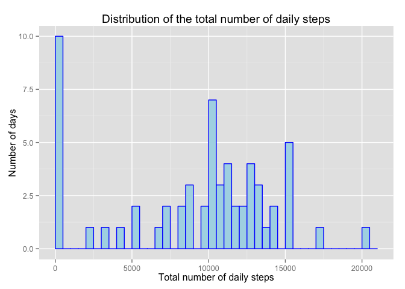
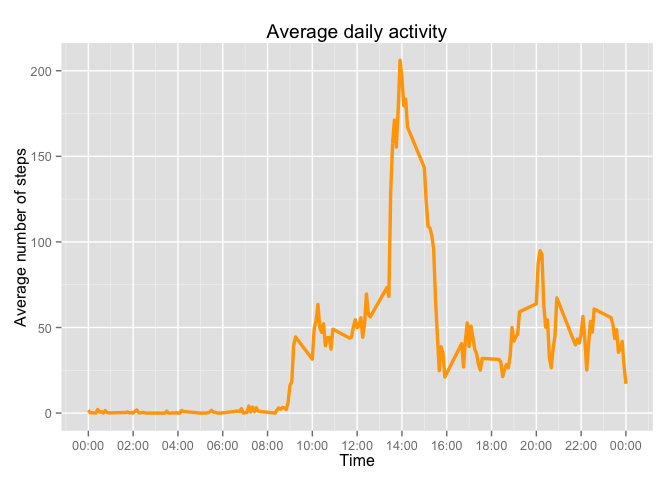
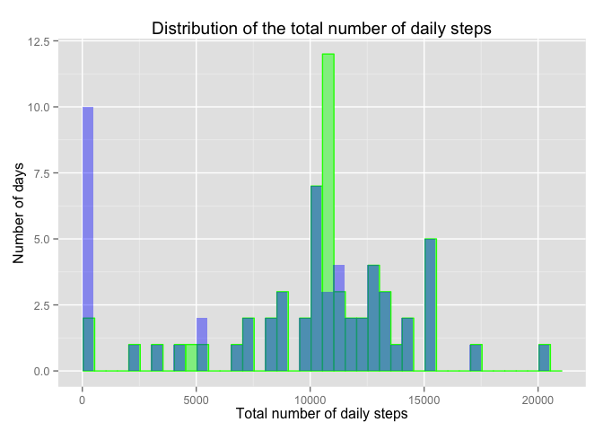
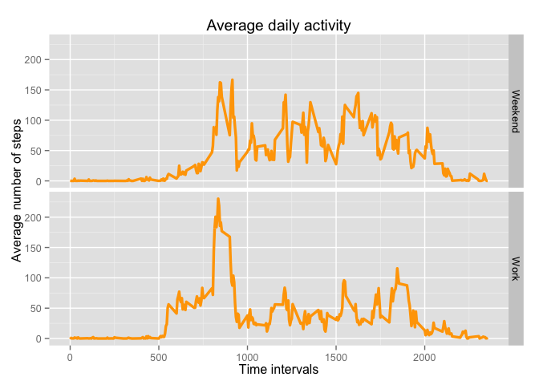

# Reproducible Research: Peer Assessment 1

I analyse a dataset containing the number of steps taken by a single individual over a period of time. Each day is split into a sequence of 5-minute intervals and the total number of steps performed in each of these intervals is recorded. For some intervals the data is not available. The goal of the analysis is to see the daily trend, the differences between working days and weekends and the overall distribution of the total number of steps taken per day.

Below is the description of the data anlysis and the code used to perform it. 

## Loading and preprocessing the data

I first load the raw data in.


```r
setwd("~/Coursera/DataScience/Repr_Research/RepData_PeerAssessment1")
infile <- "activity.csv"
indata <- read.csv(infile, sep= ",", header=TRUE)
print(head(indata))
```

```
##   steps       date interval
## 1    NA 2012-10-01        0
## 2    NA 2012-10-01        5
## 3    NA 2012-10-01       10
## 4    NA 2012-10-01       15
## 5    NA 2012-10-01       20
## 6    NA 2012-10-01       25
```

I will use the dplyr library to easily manipulate the raw data. I apply the tbl_df() function to restrict the number of rows that will be printed to the screen.


```r
library(dplyr)
indata_converted <- tbl_df(indata)
```

## What is mean total number of steps taken per day?
I use the dplyr's functions group_by() and summarise() to sum all steps taken each day. I then take the mean and median by ignoring NA values.

```r
group_by_date <- group_by(indata_converted, date)
tot_steps_day <- summarise(group_by_date, sum = sum(steps, na.rm=TRUE))
#mean_daily_steps <- mean(tot_steps_day$`sum(steps)`, na.rm=TRUE)
#median_daily_steps <- median(tot_steps_day$`sum(steps)`, na.rm=TRUE)
mean_daily_steps <- mean(tot_steps_day$sum, na.rm=TRUE)
median_daily_steps <- median(tot_steps_day$sum, na.rm=TRUE)
```
Here are the values:

```r
print(mean_daily_steps)
```

```
## [1] 9354.23
```

```r
print(median_daily_steps)
```

```
## [1] 10395
```

I now plot the overall distribution in the form of an histogram. This gives an idea of how often the person has walked a given number of steps.

```r
library(ggplot2)
ggplot(data=tot_steps_day, aes(sum, na.rm=TRUE)) + 
  geom_histogram(breaks=seq(min(tot_steps_day$sum, na.rm = TRUE),max(tot_steps_day$sum, na.rm=TRUE), by=500),
                 fill = 'light blue',
                 col = 'blue') +
  labs(title = 'Distribution of the total number of daily steps',
       x = "Total number of daily steps",
       y = "Number of days") 
```

 

```r
ggsave("histogram_no_nas.pdf")
```
The plot shows that the distribution is not too distant from a gaussian, which was already hinted at by the fact that the mean and median values are very similar.

## What is the average daily activity pattern?


I now group the original data by time interval, instead of by date as done above. I then compute the mean value of the steps walked during each time interval across all days recorded. I am ignoring NA values for now.

```r
group_by_interval <- group_by(indata_converted, interval)
mean_steps_interval <- summarise(group_by_interval, mean_steps_int = mean(steps, na.rm=TRUE))
```

I now convert the time interval to an actual time, i.e. something in the format HH:MM. I add this new value in a new "time" column.


```r
hour <- mean_steps_interval$interval %/% 60
minute <- mean_steps_interval$interval %% 60

mean_steps_interval$time <- 0
for (i in 1:nrow(mean_steps_interval)) {
  
  mean_steps_interval$time[i] <- paste(toString(hour[i]), toString(minute[i]), sep=":")
  
}
 mean_steps_interval$time <- as.POSIXct(mean_steps_interval$time, format="%H:%M")
head(mean_steps_interval)
```

```
## Source: local data frame [6 x 3]
## 
##   interval mean_steps_int                time
## 1        0      1.7169811 2016-03-15 00:00:00
## 2        5      0.3396226 2016-03-15 00:05:00
## 3       10      0.1320755 2016-03-15 00:10:00
## 4       15      0.1509434 2016-03-15 00:15:00
## 5       20      0.0754717 2016-03-15 00:20:00
## 6       25      2.0943396 2016-03-15 00:25:00
```

I now plot the average number of steps walked per time interval during a day.


```r
library(scales)

ggplot(data=mean_steps_interval, aes(time, mean_steps_int, na.rm=TRUE)) + 
  geom_line(col="orange",
            size=1.2) +
  scale_x_datetime(breaks=("2 hour"), labels=date_format("%H:%M")) +
  labs(title = 'Average daily activity',
       y = "Average number of steps",
       x = "Time") 
```

 

```r
ggsave("daily_activity.pdf")
```

There is a clear peak around 14:00. Below I evaluate the time interval this corresponds to.


```r
max_steps <- max(mean_steps_interval$mean_steps_int)
max_steps_ind <- which.max(mean_steps_interval$mean_steps_int)
time_max_steps <- mean_steps_interval$interval[max_steps_ind]
print(time_max_steps)
```

```
## [1] 835
```

## Imputing missing values
This is the number of NA values in the original data:


```r
tot_na_values <- sum(is.na(indata$steps)) 
print(tot_na_values)
```

```
## [1] 2304
```


I create a new dataframe by copying the original *date* and *interval* columns and by filling the new *steps* column with zeros. I then fill the latter with the original values, when they are available; as for NAs, I replace them with the mean over the given time interval.

```r
new_indata <- data.frame(date = indata$date, interval = indata$interval, steps = 0)

for (i in 1:nrow(indata)){
  
  if (is.na(indata$steps[i])) {
    interval <- indata$interval[i]
    newval_ind <- which(mean_steps_interval$interval == interval)
    newval <- mean_steps_interval$mean_steps_int[newval_ind]
    new_indata$steps[i] <- newval
  } else {
    new_indata$steps[i] <- indata$steps[i]
  }
  
}

print(head(new_indata))
```

```
##         date interval     steps
## 1 2012-10-01        0 1.7169811
## 2 2012-10-01        5 0.3396226
## 3 2012-10-01       10 0.1320755
## 4 2012-10-01       15 0.1509434
## 5 2012-10-01       20 0.0754717
## 6 2012-10-01       25 2.0943396
```

I then replicate the same analysis as above to compute mean and median of the total number of daily steps.

```r
new_indata_converted <- tbl_df(new_indata)
new_group_by_date <- group_by(new_indata_converted, date)
new_tot_steps_day <- summarise(new_group_by_date, sum = sum(steps))
new_mean_daily_steps <- mean(new_tot_steps_day$sum)
new_median_daily_steps <- median(new_tot_steps_day$sum)
print(new_mean_daily_steps)
```

```
## [1] 10766.19
```

```r
print(new_median_daily_steps)
```

```
## [1] 10766.19
```

They do not change dramatically. This is confirmed by the plot below, showing the new histogram (in green), plotted together with the previous one (in blue). This is not surprising as the treatment for NAs has strenghtened the mean behaviour.


```r
ggplot(data=new_tot_steps_day, aes(sum)) + 
  geom_histogram(breaks=seq(min(new_tot_steps_day$sum), max(new_tot_steps_day$sum), by=500),
                 fill = 'light green',
                 col = 'green') + 
  geom_histogram(data = tot_steps_day, breaks=seq(min(tot_steps_day$sum, na.rm = TRUE),max(tot_steps_day$sum, na.rm=TRUE), by=500),
                 fill = 'blue',
                 alpha = 0.4) +
  labs(title = 'Distribution of the total number of daily steps',
       x = "Total number of daily steps",
       y = "Number of days") 
```

 

```r
ggsave("histogram_subs_nas.pdf")
```


## Are there differences in activity patterns between weekdays and weekends?
I am using the lubridate function wday() to associate the weekday to each date. I am also labelling each of the days as "Work" or "Weekend". I am adding both labels as two new colums.

```r
library(lubridate)
new_indata_converted$date <- as.Date(new_indata_converted$date)
new_indata_converted$weekday <- wday(new_indata_converted$date, label = TRUE)

new_indata_converted$work_or_we <- " "

for (i in 1:nrow(new_indata_converted)){
  if(new_indata_converted$weekday[i] != "Sat" & new_indata_converted$weekday[i] != "Sun"){
    new_indata_converted$work_or_we[i] <- "Work"
  } else {
    new_indata_converted$work_or_we[i] <- "Weekend"
  }
}

new_indata_converted$work_or_we <- as.factor(new_indata_converted$work_or_we)

head(new_indata_converted)
```

```
## Source: local data frame [6 x 5]
## 
##         date interval     steps weekday work_or_we
## 1 2012-10-01        0 1.7169811     Mon       Work
## 2 2012-10-01        5 0.3396226     Mon       Work
## 3 2012-10-01       10 0.1320755     Mon       Work
## 4 2012-10-01       15 0.1509434     Mon       Work
## 5 2012-10-01       20 0.0754717     Mon       Work
## 6 2012-10-01       25 2.0943396     Mon       Work
```

I am now grouping the data by time interval and by the Work/Weekend factor.

```r
new_group_by_interval <- group_by(new_indata_converted, interval, work_or_we)
new_mean_steps_interval <- summarise(new_group_by_interval, mean_steps_int = mean(steps))
```

Below is the same plot of the daily activity, just split by the Work/Weekend factor and with the replaced NA values.

```r
ggplot(data=new_mean_steps_interval, aes(interval, mean_steps_int)) + 
  geom_line(col="orange",
            size=1.2) +
  facet_grid(work_or_we ~ .)+
  labs(title = 'Average daily activity',
       y = "Average number of steps",
       x = "Time intervals") 
```

 

```r
ggsave("daily_activity_work_we_subs_nas.pdf")
```
## Conclusions
The distribution of total daily steps is approximately gaussian, with the peak close to 1100. During weekdays there is a clear peak of steps walked around 14:00, whereas during the weekend the activity is more evenly spread during the day. About 10% of the data is missing and has either been ignored or substituted by the average behaviour in the corresponding time interval. No particular remarks, except the arbitrariness in dealing with missing data.
